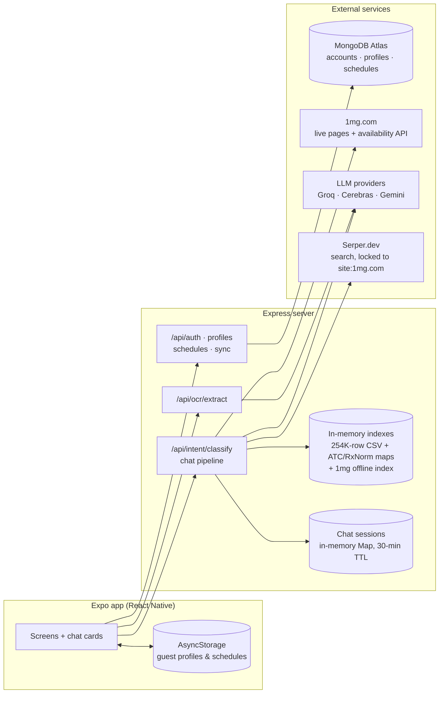
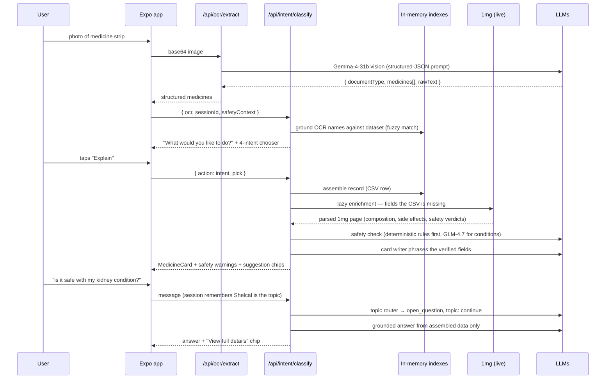

# MedScan — Architecture

This document explains how MedScan works as a system: what the pieces are, where the data lives and why, how a request flows end to end, and how safety warnings are decided. For a turn-by-turn deep dive into the chat pipeline (topic routing, medicine-detection algorithms, web-search enrichment, session state), see **[docs/CHAT_PIPELINE.md](docs/CHAT_PIPELINE.md)**.

**Contents**

1. [System overview](#1-system-overview)
2. [One full flow, end to end](#2-one-full-flow-end-to-end)
3. [Data layer — and why MongoDB](#3-data-layer--and-why-mongodb)
4. [The datasets](#4-the-datasets)
5. [Safety & warnings layer](#5-safety--warnings-layer)
6. [Scan / vision flow](#6-scan--vision-flow)
7. [LLM strategy — "the LLM never authors medical facts"](#7-llm-strategy--the-llm-never-authors-medical-facts)
8. [API surface](#8-api-surface)

---

## 1. System overview

MedScan is two independent codebases in one repo:

- **Mobile app** (repo root) — React Native + Expo SDK 54, Expo Router file-based screens in `app/`, chat cards in `components/`. Works fully offline-from-account ("guest mode") using AsyncStorage.
- **Server** (`server/`) — Node/Express. Holds the entire medicine brain: the 254K-row dataset in memory, all search indexes, the chat pipeline, the safety engine, and every LLM call. The app never talks to an LLM directly.



### Startup sequence

[`server/index.js`](server/index.js) boots three loaders **in parallel**, and all three are non-fatal:

| Loader | What it builds | If it fails |
|---|---|---|
| `loadMedicines()` ([medicineSearch.service.js](server/services/medicineSearch.service.js)) | Streams `data/medicines.csv` once; builds the filtered substitute-search array, name map, ingredient index, and ATC prefix indexes | Search features degrade |
| `initMedicineService()` ([medicineExtraction.service.js](server/services/medicineExtraction.service.js)) | Streams the same CSV again; builds the FlexSearch name index + character-trigram fallback index used to detect medicines in free text | Chat extraction degrades |
| `connectDB()` ([config/db.js](server/config/db.js)) | Mongoose connection to Atlas (with a public-DNS retry for home routers that can't resolve SRV records) | Server still boots; auth/profile/schedule routes return 503, **guest mode keeps working** |

This "everything optional" posture is deliberate: the core product (scan → explain → compare → alternatives) needs zero cloud state.

---

## 2. One full flow, end to end

The best way to understand MedScan is to follow one realistic session: *the user scans a strip of Shelcal 500, then asks "is it safe with my kidney condition?"* — with a health profile that lists kidney disease.



What happened at each hop:

1. **Vision** ([Section 6](#6-scan--vision-flow)) turned pixels into structured JSON — but nothing is trusted yet.
2. **Grounding**: each OCR'd name is fuzzy-matched against the real dataset ([`resolveImageMedicines`](server/services/medicineExtraction.service.js)). A misread like "Shelcal 5O0" still lands on the right row; genuinely ambiguous reads produce a "which did you mean?" picker instead of a guess.
3. **Intent chooser**: an image with no accompanying text doesn't presume what the user wants — the app shows Explain / Compare / Find alternatives / Schedule / Check availability.
4. **Assembly + enrichment**: the CSV row is the base record; empty fields are filled on demand from a verified 1mg page ([docs/CHAT_PIPELINE.md §4](docs/CHAT_PIPELINE.md#4-when-web-search-fires-lazy-enrichment)).
5. **Safety** ([Section 5](#5-safety--warnings-layer)): the profile (kidney disease) crosses the medicine's 1mg safety verdicts and the ATC rule engine — deterministic rules fire before any LLM sees anything.
6. **Follow-up**: "is *it* safe…" never re-extracts a medicine name. The session's `focusedMedicine` is Shelcal; the topic router classifies the message as an open question on the current topic, and the answer is written **only** from the already-verified assembled data.

---

## 3. Data layer — and why MongoDB

MedScan splits data by a simple rule: **medicine facts are read-only reference data; user state is the only thing that needs a database.**

### Medicine facts: in-memory, from files

All medicine knowledge comes from files in [`server/data/`](server/data/), loaded into RAM at boot:

- The dataset is **read-only** at runtime — nothing ever writes a medicine row, so a database adds round-trips and operational surface for zero benefit.
- Fuzzy medicine detection needs custom scoring (weighted token similarity, trigram fallback) over **all 254K names on every keystroke-level query**. That's an in-process index problem, not a DB query problem.
- The whole working set (~45 MB CSV + ~39 MB 1mg index + reference maps) fits comfortably in memory on a small node.

### User state: MongoDB — but optional

MongoDB (Atlas) stores exactly three collections, defined in [`server/models/`](server/models):

**`accounts`** ([account.model.js](server/models/account.model.js))

| Field | Type | Notes |
|---|---|---|
| `email` | String | unique, lowercased |
| `passwordHash` | String | bcrypt, 10 rounds |
| `activeProfileId` | ObjectId → Profile | last active member |
| `createdAt` | Date | |

**`profiles`** ([profile.model.js](server/models/profile.model.js)) — one account → many family-member profiles ("Netflix model")

| Field | Type | Notes |
|---|---|---|
| `accountId` | ObjectId → Account | indexed |
| `label`, `relation` | String | relation: self/mother/father/spouse/child/other |
| `ageYears`, `gender` | Number / enum | |
| `pregnant`, `breastfeeding` | Boolean | |
| `allergies[]`, `conditions[]` | [String] | drive the safety layer |
| `alcohol` | enum | none/occasional/regular |
| `otherMedicines[]` | [String] | current medicines, cross-checked for interactions |

**`schedules`** ([schedule.model.js](server/models/schedule.model.js)) — dose reminders

| Field | Type | Notes |
|---|---|---|
| `accountId`, `profileId` | ObjectId | both indexed |
| `medicineName`, `medicineType`, `dose` | String | |
| `days[]` | [Number] | 0=Mon … 6=Sun |
| `time` | String | "HH:MM" 24h |
| `instruction`, `notes`, `notificationEnabled` | | |

**Why MongoDB specifically:**

- These three collections are the *only* data that must **sync across devices and survive reinstalls** — that's the entire reason a cloud database exists here.
- The documents are small, schema-flexible, and never joined against the medicine dataset; a document store matches the shape exactly (a profile *is* one JSON object the app edits as a unit).
- Atlas free tier + Mongoose keeps the account layer at near-zero cost and code.

**Guest mode is a first-class citizen**: the app keeps identical profile/schedule shapes in AsyncStorage ([app/services/profileService.js](app/services/profileService.js), [scheduleService.js](app/services/scheduleService.js)). Because the shapes mirror the Mongoose schemas field-for-field, signing in later is a straight merge — [`POST /api/sync/merge`](server/routes/sync.routes.js) dedupes profiles by label and schedules by (profile, name, time), then returns the server's canonical state.

**What is deliberately *not* in the database:**

- **Chat sessions** — an in-memory `Map` with a 30-minute idle TTL ([session.service.js](server/services/session.service.js)). Conversation state is ephemeral by design; losing it on restart costs the user one clarifying tap, while persisting it would store health-adjacent conversation data for no product benefit.
- **Safety-check results** — cached in memory only, 24 h TTL, because entries contain profile-derived text (see [Section 5](#5-safety--warnings-layer)).
- **Scan history** — images are processed and discarded; nothing is stored.

### The coverage gap that shaped the architecture

Roughly **97% of the CSV's rows have empty** `medicine_desc` / `side_effects` / salt fields. That single fact explains a lot of the design: rather than pre-scraping 254K pages (slow, mostly wasted — users ask about a tiny fraction of medicines), MedScan enriches **lazily, on demand**, from the exact 1mg page for the medicine being asked about, and caches the result forever in an append-only NDJSON file. Details in [docs/CHAT_PIPELINE.md §4](docs/CHAT_PIPELINE.md#4-when-web-search-fires-lazy-enrichment).

---

## 4. The datasets

Everything in [`server/data/`](server/data/):

| File | Size | What it is |
|---|---|---|
| `medicines.csv` | ~45 MB, 254K rows | The base dataset (Indian retail medicines). Columns: `id, name, price, Is_discontinued, manufacturer_name, type, pack_size_label, short_composition1/2, salt_composition, medicine_desc, side_effects, drug_interactions` |
| `1mg_index.json` | ~39 MB | Offline map of ~374K normalized 1mg product names → `{url, id}`, built from 1mg's public sitemaps by [`scripts/build1mgIndex.js`](server/scripts/build1mgIndex.js). Lets the server find the right 1mg page **without a search API call** |
| `atcMap.json` | 33 KB | Full WHO ATC code → official class name (e.g. `M01A` → "Anti-inflammatory and antirheumatic products, non-steroids"), built by [`scripts/buildAtcMap.js`](server/scripts/buildAtcMap.js) |
| `atcCurated.json` | 9 KB | Hand-written patient-friendly overlay per ATC group: `{ friendlyLabel, commonUses[] }` — longest-prefix wins over `atcMap` |
| `ingredientCodes.json` | 206 KB | The RxNorm bridge: canonical ingredient → `{ rxcui, atc[], baseIngredient, isCombination, components[] }`. This is how a CSV salt string becomes ATC classes |
| `ingredientNormalization.json` | 75 KB | Raw ingredient spelling → canonical name |
| `lazyEnrichment.cache.ndjson` | grows over time | On-demand enrichment cache, one JSON object per line: `{ key, name, found, fields{...}, sources[1mg urls], at }`. Append-only; loaded once at boot |

At load time, [`medicineSearch.service.js`](server/services/medicineSearch.service.js) precomputes per-row `ingredients`, a dose map, and ATC `domains`, then builds four indexes: the filtered substitutes array, a name→record map, ingredient→rows, and 4-/5-char ATC-prefix→rows. [`medicineExtraction.service.js`](server/services/medicineExtraction.service.js) independently builds the FlexSearch + trigram indexes used for free-text detection.

---

## 5. Safety & warnings layer

Warnings appear on explain cards and comparison cards **only when the active profile actually has something to check** — an empty profile produces no safety section at all, and nothing profile-related is ever persisted server-side. The client sends `safetyContext = { profile, currentMedicines, profileHash }` with each chat turn; `currentMedicines` is the profile's `otherMedicines` plus every scheduled medicine's name.

[`runSafetyCheck`](server/services/safetyCheck.service.js) runs **two layers, deterministic first**:

### Layer 1 — deterministic (always runs, no LLM)

1. **1mg safety-advice verdicts × profile flags.** Enriched records carry per-category verdicts parsed from the 1mg page (`SAFE / UNSAFE / CAUTION / CONSULT` for pregnancy, breastfeeding, alcohol, kidney, liver, driving). These cross the profile directly: pregnant + `UNSAFE` pregnancy verdict → high-severity warning; `CAUTION/CONSULT` → medium.
2. **Drug-interaction matching.** The medicine's interaction list (1mg-parsed or CSV) is matched against the salts of everything the user currently takes. Severity maps from the source's own rating (life-threatening/severe → high, moderate → medium, mild → low).
3. **ATC rule engine** ([atcRules.service.js](server/services/atcRules.service.js)). Each medicine resolves to ATC classes via `ingredientCodes.json`, then curated pharmacology rules fire:

   | Rule | ATC prefix × profile fact | Severity |
   |---|---|---|
   | NSAID × kidney disease | `M01A` × kidney condition | high |
   | NSAID × ulcer/gastric | `M01A` × GI condition | high |
   | Corticosteroid × diabetes | `H02` × diabetes | medium |
   | Antithrombotic × bleeding disorder | `B01` × bleeding | high |
   | CNS medicine × regular alcohol | `N05`/`N06` × alcohol | medium |
   | **Duplicate therapy** (cross-medicine) | same salt, or same 5-char ATC subgroup | high |
   | Same 4-char ATC subgroup | | medium |
   | Dual antibiotics | both `J01` | low (informational) |

   Two precision details: resolution restricts to each ingredient's *primary* 3-char class (RxNorm marks combination products as members of many classes, which would produce false duplicate-therapy hits), and topical products (gel/cream/drops by name) skip condition rules — a diclofenac gel should not trigger the NSAID×kidney rule.

The same duplicate-therapy grouper powers the pre-save check in the schedule form and the banner on the reminders page, via the public `POST /api/schedules/check-duplicate` endpoint — it works for guests too.

### Layer 2 — LLM, narrow mandate

Only if the profile has `allergies` or `conditions` does Cerebras **GLM-4.7** get called (temperature 0, 8 s budget), and only for what deterministic rules can't do: judging whether a listed allergy or free-text condition relates to this medicine's composition. Its output goes through `validateLlmWarnings`: unknown warning types are dropped, warnings that don't match an actual profile fact are dropped, and an allergy flagged "high" is **capped to "medium" when the composition is unverified**. If the LLM layer was needed but failed, and deterministic rules found nothing, the check returns "unchecked" rather than a false "no concerns."

Results are capped (≤5 warnings per medicine, ≤220 chars each) and cached **in memory only** for 24 h, keyed by (medicines + profileHash) — a deliberate privacy split: the disk-persisted enrichment cache holds only public 1mg facts, while anything derived from a health profile never touches disk.

---

## 6. Scan / vision flow

```
camera / gallery  →  base64 (client)  →  POST /api/ocr/extract  →  vision LLM  →  structured JSON  →  chat pipeline grounds it
```

- The client ([app/services/ocrService.js](app/services/ocrService.js)) captures via expo-image-picker and POSTs `{ image, mimeType }`.
- The provider is switched by a file flag in [`config/llmProviders.js`](server/config/llmProviders.js): **Cerebras `gemma-4-31b` (default)** or **Gemini 2.5 Flash (backup)**. Both consume the *same* extraction prompt (defined once in [gemini.service.js](server/services/gemini.service.js), imported by [cerebras.service.js](server/services/cerebras.service.js)) so they are drop-in interchangeable. Output contract:

  ```json
  { "documentType": "medicine_label" | "prescription" | "unrelated",
    "medicines": [{ "name": "...", "ingredients": [], "dosage": "..." }],
    "rawText": "..." }
  ```

- The app forwards that JSON into `/api/intent/classify` as the `ocr` field. The controller grounds every detected name against the dataset (fuzzy match — vision misreads are expected and corrected), asks "which did you mean?" for ambiguous ones, and if the image came with no text and no active goal, shows the 4-intent chooser rather than assuming. `documentType: "unrelated"` short-circuits to "I couldn't find a medicine in this image."

---

## 7. LLM strategy — "the LLM never authors medical facts"

Every medical fact shown to the user — price, salt, side effect, verdict, interaction — traces to a dataset row, an ATC rule, or a parsed 1mg page. LLMs are allowed exactly three verbs: **route** (what does the user want?), **phrase** (turn verified fields into readable prose), and **judge** (is this candidate relevant / a false positive?). They are never asked to *know* anything about a medicine.

| Call site | Verb | Model | Provider |
|---|---|---|---|
| Topic routing (1 call/turn) | route | `gpt-oss-20b` (fast) | Groq |
| Medicine-name confirm (single fuzzy candidate) | judge | `gpt-oss-20b` | Groq |
| Explain-card writer, targeted field answers, open-question answers (grounded) | phrase | `gpt-oss-20b` | Groq |
| Suggestion chips | phrase | `gpt-oss-20b` | Groq |
| Enrichment query builder / relevance gap-check / snippet echo | route / judge | `gpt-oss-20b` | Groq |
| Compare-mention validation ("lets compare" ≠ the medicine "Lets 2.5mg") | judge | `gpt-oss-120b` (smart) | Groq |
| Comparison summary writer | phrase | `gpt-oss-120b` | Groq |
| Personalized safety (allergies/conditions only) | judge | `zai-glm-4.7` | Cerebras |
| Vision OCR | extract | `gemma-4-31b` / Gemini 2.5 Flash | Cerebras / Google |
| Web search (enrichment fallback only) | — | Serper, **site-locked to `site:1mg.com` in code** | Serper |

Operational notes baked into the code:

- Groq's two tiers share **one 8K-tokens-per-minute free-tier budget** — the 120b "smart" tier is reserved for the two call sites that genuinely need semantic judgment, and reasoning traces are capped so they can't eat the JSON output budget.
- Cerebras calls share a 5 requests/minute pool, which is why safety checks are cached and timeout-bounded rather than retried.
- Grounded answering is enforced by prompt *and* by construction: the open-question writer ([prompts/openAnswer.prompt.js](server/prompts/openAnswer.prompt.js)) receives only the assembled verified record and must answer "I don't have verified information on that" when the record doesn't cover the question.
- All LLM output is JSON-mode + whitelist-validated; every router/classifier has a deterministic fallback, so an LLM failure degrades the experience but never dead-ends a conversation.

---

## 8. API surface

All routes mounted in [`server/index.js`](server/index.js):

| Method | Path | Auth | Purpose |
|---|---|---|---|
| GET | `/healthz` | — | liveness probe |
| POST | `/api/intent/classify` | — | **the entire chat pipeline** — message/action/OCR in, typed cards out |
| POST | `/api/ocr/extract` | — | vision OCR → structured medicines |
| POST | `/medicine/find-similar` | — | same-salt substitutes for an ingredient string |
| POST | `/api/auth/signup`, `/login` | — (needs DB) | account create / login → 30-day JWT |
| GET/POST | `/api/profiles` | JWT | list / create member profiles |
| PUT | `/api/profiles/:id`, `/active/:id` | JWT | update / set active profile |
| DELETE | `/api/profiles/:id` | JWT | delete profile (cleans up its schedules) |
| POST | `/api/schedules/check-duplicate` | **public** | duplicate-therapy check by ATC (guest-usable) |
| GET/POST/PUT/DELETE | `/api/schedules[...]` | JWT | reminder CRUD |
| POST | `/api/sync/merge` | JWT | one-time guest → account merge |

Note what's *not* here: chat features like "compare" or "find alternatives" are **not** HTTP endpoints. They are internal intent handlers ([`server/handlers/`](server/handlers), dispatched via [registry.js](server/handlers/registry.js)) inside the single `/api/intent/classify` route — the conversation, not the URL, selects the behavior. How that dispatch works is the subject of **[docs/CHAT_PIPELINE.md](docs/CHAT_PIPELINE.md)**.
