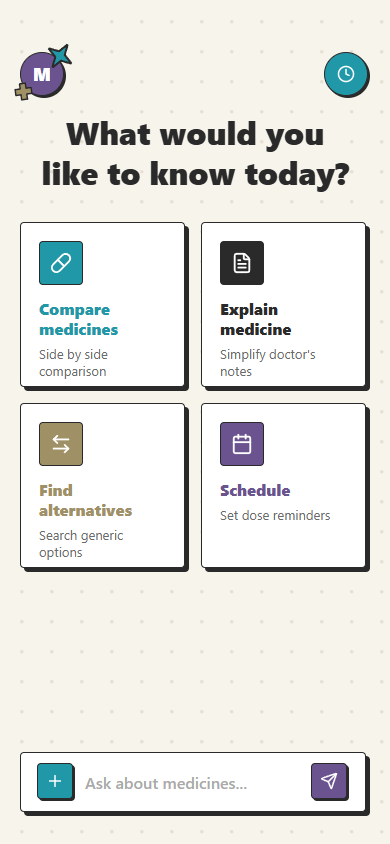
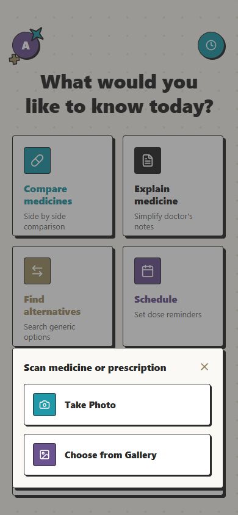
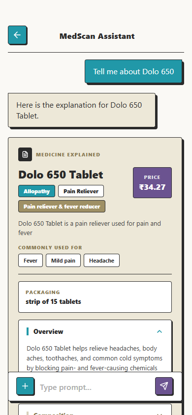
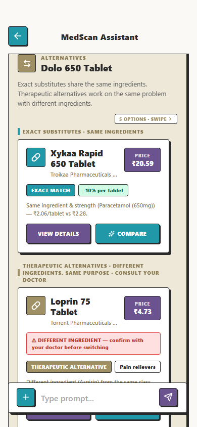
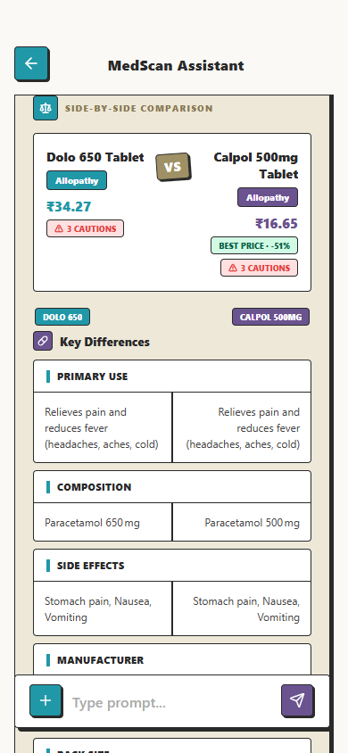
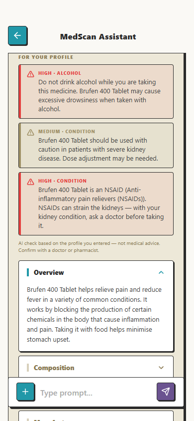
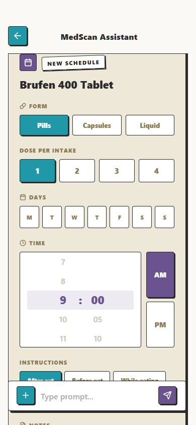
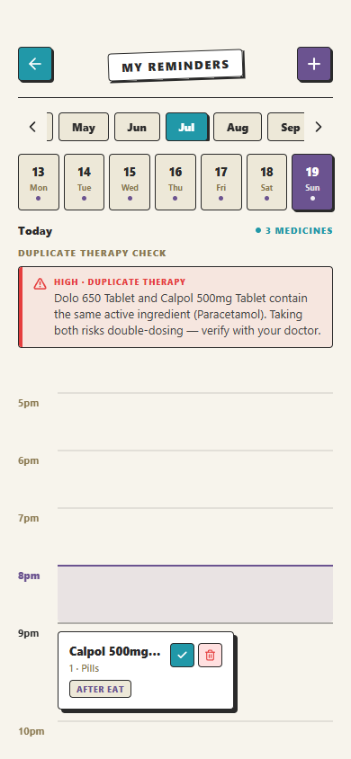
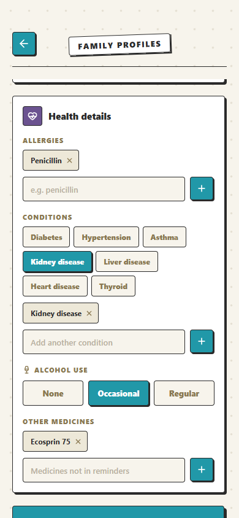

# MedScan 💊

**Scan, understand, and manage medicines — an AI-assisted medicine companion for Indian medicines.**

MedScan is a React Native (Expo) app backed by a Node/Express server. Point your camera at a medicine strip or a doctor's prescription, or just type a question, and MedScan can explain the medicine, find cheaper substitutes, compare two medicines side by side, check delivery availability for your pincode, and set up dose reminders — with **personalized safety warnings** checked against your health profile (allergies, conditions, pregnancy, current medicines).

The core design principle: **the LLM never authors medical facts.** Every price, salt composition, side effect, and warning traces back to a real record — a 254K-row medicines dataset, deterministic ATC classification rules, or a verified 1mg page fetched on demand. LLMs are used only to *route*, *phrase*, and *judge* — never to invent.

> 📐 **Want the deep dive?** The full technical breakdown — chat pipeline, medicine-detection algorithms, safety rule engine, data model — lives in [ARCHITECTURE.md](ARCHITECTURE.md).

---

## Demo

<table>
  <tr>
    <td align="center"><br/><sub><b>Home</b> — scan or ask</sub></td>
    <td align="center"><br/><sub><b>Scan</b> — label / prescription OCR</sub></td>
    <td align="center"><br/><sub><b>Explain</b> — full medicine card</sub></td>
  </tr>
  <tr>
    <td align="center"><br/><sub><b>Alternatives</b> — same-salt & same-class</sub></td>
    <td align="center"><br/><sub><b>Compare</b> — side-by-side</sub></td>
    <td align="center"><br/><sub><b>Safety</b> — profile-aware warnings</sub></td>
  </tr>
  <tr>
    <td align="center"><br/><sub><b>Schedule</b> — in-chat reminder setup</sub></td>
    <td align="center"><br/><sub><b>Reminders</b> — with duplicate-therapy banner</sub></td>
    <td align="center"><br/><sub><b>Profiles</b> — one per family member</sub></td>
  </tr>
</table>

*(Screenshots live in `docs/screenshots/` — see the note there for the capture list.)*

---

## What it can do

| Feature | How |
|---|---|
| 🔍 **Explain a medicine** | Full card (overview, composition, side effects, price, manufacturer, therapeutic class) or a targeted one-line answer ("price of Dolo 650?") |
| 💬 **Answer open questions** | "Can I take it with milk?" — answered *only* from verified assembled data, with an honest "not found" when the data isn't there |
| 💰 **Find alternatives** | Same-salt substitutes (exact / different strength / combination) ranked by per-unit price, plus same-ATC-class therapeutic options when no direct substitute exists |
| ⚖️ **Compare two medicines** | Deterministic database columns + LLM-written comparative summary |
| 📅 **Schedule reminders** | In-chat form → local notifications; duplicate-therapy check before saving |
| 📦 **Check availability** | Live 1mg availability + delivery estimate for a pincode |
| 📷 **Scan labels & prescriptions** | Vision LLM reads the image into structured medicines, grounded against the dataset |
| ⚠️ **Personalized safety warnings** | Health profile × medicine: pregnancy/alcohol/kidney/liver verdicts, drug-interaction matching, ATC rule engine (NSAID + kidney disease, steroid + diabetes, duplicate therapy…) |
| 👨‍👩‍👧 **Family profiles** | Netflix-style member profiles; works fully as a guest (on-device) or with an account (MongoDB sync) |

---

## Tech stack

**App** — React Native (Expo SDK 54), Expo Router, NativeWind/Tailwind, AsyncStorage (guest persistence), expo-camera + image picker (OCR input).

**Server** — Node.js, Express 5, in-memory search indexes (FlexSearch + custom trigram + ingredient/ATC maps) over a 254K-row medicines CSV, Mongoose/MongoDB (accounts, profiles, schedules only), JWT auth.

**AI / data providers** —

| Role | Model | Provider |
|---|---|---|
| Routing, extraction, card writing, suggestions | `gpt-oss-20b` (fast tier) | Groq |
| Hard semantic judgments (compare validation & writing) | `gpt-oss-120b` (smart tier) | Groq |
| Personalized safety checks | `zai-glm-4.7` | Cerebras |
| OCR / vision | `gemma-4-31b` (default) / Gemini 2.5 Flash (backup) | Cerebras / Google |
| Web search (enrichment fallback only) | Serper.dev (locked to `site:1mg.com`) | Serper |

---

## Quick start

### 1. Server

```bash
cd server
npm install
```

Create `server/.env`:

```env
GROQ_API_KEY=...        # required — chat pipeline
CEREBRAS_API_KEY=...    # required — OCR + safety checks
GEMINI_API_KEY=...      # optional — backup vision provider
SERPER_API_KEY=...      # optional — web-search enrichment fallback
MONGODB_URI=...         # optional — accounts/profiles/schedules (guest mode works without it)
JWT_SECRET=...          # required only if MONGODB_URI is set
```

```bash
npm start   # loads the CSV + builds indexes (~a few seconds), listens on :3000
```

### 2. App

```bash
npm install
npx expo start          # or: npx expo run:android
```

The app auto-detects the server on your LAN in dev; set `EXPO_PUBLIC_API_URL` to point elsewhere.

---

## Repository layout

```
app/                  Expo Router screens (home, chat, reminders, profiles, auth)
  services/           client-side services (auth, profiles, schedules, OCR, sync)
components/           chat cards & UI (MedicineCard, AlternativesCarousel, ComparisonCard, …)
server/
  controllers/        intent.controller.js — the chat pipeline orchestrator
  handlers/           one handler per intent (explain / compare / alternatives / schedule / availability)
  services/           routing, extraction, search, enrichment, safety, LLM providers
  prompts/            every LLM system prompt, one file each
  models/             Mongoose schemas (Account, Profile, Schedule)
  routes/             Express routes (intent, ocr, auth, profiles, schedules, sync)
  data/               medicines.csv + ATC/ingredient reference data + 1mg index + caches
```

---

## Documentation

- **[ARCHITECTURE.md](ARCHITECTURE.md)** — the system: end-to-end flow, the data layer and why MongoDB, the datasets, how safety warnings are decided, the scan/vision flow, LLM tier strategy, and the full API surface.
- **[docs/CHAT_PIPELINE.md](docs/CHAT_PIPELINE.md)** — one chat turn under the microscope: topic routing, how medicines are detected in free text (and when the system asks "which one did you mean?"), when web search fires, and how conversation context works.
- **[docs/notes/](docs/notes)** — historical design and planning notes.

> ⚕️ **Disclaimer:** MedScan is an information tool, not medical advice. It deliberately refuses symptom-based medicine recommendations and always defers dosing decisions to a doctor.
