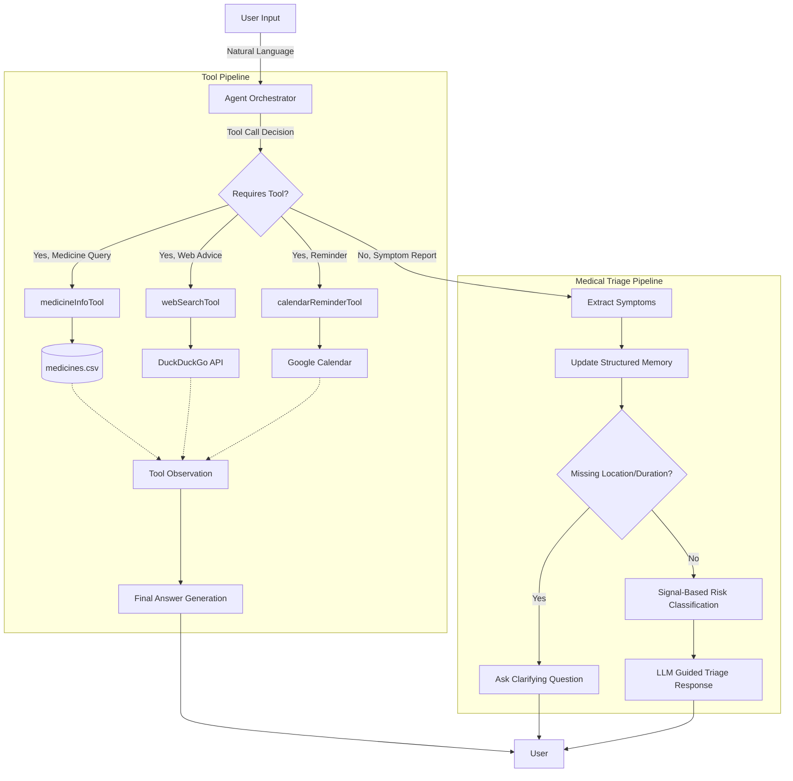
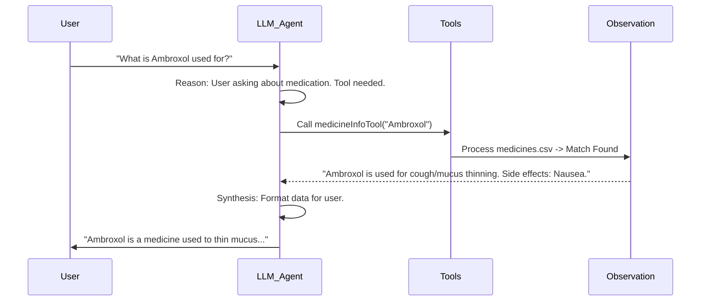

# Agentic AI System using Modern LLM-based Tools
**Lab CA-Activity 1 - Group Activity**

## 1. Goal of the Agent
The Medical Scan Information Agent is an autonomous system designed to act as a **Healthcare Information Assistant**. Its primary goal is to safely triage patient symptoms using objective clinical signal frameworks without giving diagnostic conclusions, provide information on specific medicines, perform web searches for health remedies, and schedule medication reminders. It strictly avoids diagnosing patients directly and instead offers guidelines for either at-home care, moderate medical attention, or urgent medical interventions.

## 2. Agent Role
The agent acts as an **Orchestrator and Reasoning Engine**. It continuously:
* **Listens**: Processes natural language input from users regarding their symptoms or queries.
* **Reasons**: Determines the intent—whether to use an external tool or route to the triage reasoning framework.
* **Acts**: If a specific tool is required (e.g., retrieving medicine information), it calls the tool and reads the observation. If symptom triage is needed, it updates a structured contextual memory (history of symptoms) and evaluates multi-symptom risk levels dynamically.

## 3. Tools Used
To transition from a static conversational agent to an active agentic AI, three LangChain tools are integrated:

### 1️⃣ medicineInfoTool (Simple Database)
* **Purpose**: Allows the agent to look up specific usage, composition, side effects, and pricing information about any medicine.
* **Implementation**: Queries a local `medicines.csv` database containing over 250,000 medicine records. It normalizes queries and extracts the matched medicine.
* **Example**: "What is Crocin used for?" → Agent searches the CSV database → Retrieves uses, composition, and side effects.

### 2️⃣ webSearchTool (Web Search API)
* **Purpose**: Fetches general health guidelines and remedies from the web instead of relying exclusively on the LLM's static weights or hardcoded rules.
* **Implementation**: Uses `duckduckgo-search` API to fetch real-time web results for search terms appending "health advice".
* **Example**: "I've had a headache for two days. What should I do?" → Agent fetches top web articles about persistent headaches.

### 3️⃣ calendarReminderTool (Utility)
* **Purpose**: Generates Google Calendar event links to remind patients about their dosages.
* **Implementation**: Takes the medicine name and interval, and outputs a formatted Google Calendar `action=TEMPLATE` link.

## 4. Memory Type (Short-term / Contextual)
The agent utilizes **Structured Contextual Memory**. As opposed to simply keeping a raw string of chat history, it parses and maintains state within a `topics` array. 
* It dynamically merges related symptoms using LLM semantic matching (e.g., Cold → Body Pain → Fever).
* It creates new isolated topics when the body systems or timing don't match (e.g., Cold → Ankle Injury).
* It strictly limits the context window to the 5 most recent topics to maintain efficiency and relevance.

## 5. Planning Strategy (ReAct / Step-by-step)
The agent operates on a **Step-by-Step Orchestration Pipeline**:
1. **Tool Check (ReAct-style intent detection)**: LLM decides whether a user prompt requires `medicineInfoTool`, `webSearchTool`, `calendarReminderTool`, or no tools.
2. **Execute & Interpret**: If a tool is called, the system runs the node script, takes the observation, and prompts the LLM to synthesize the tool's raw output into a friendly response.
3. **Medical Triage Routing**: If no tool is needed, the system transitions into an extraction and classification flow.
4. **Information Gathering**: The agent uses an LLM to evaluate if the given symptoms are missing critical metadata (severity, location, duration).
5. **Safety Evaluation**: Uses a signal combination formula coupled with bounded LLM classification to assign risk.

---

## 6. Architecture Diagram



---

## 7. Tool Flow Diagram



---

## 8. Agent Interaction Logs Example

**Example 1: Using the Web Search Tool**
```
User: I've had a headache for two days. What should I do?
🧠 [Agent Reasoning] Checking if tools are needed...
⚙️  [Tool Call] Model decided to use tool: webSearchTool with args: {"query": "headache for two days"}
👁️  [Observation] Tool returned: Web search results:
- Persistent Headaches...
🧠 [Agent Reasoning] Generating final response based on observation...
Agent: Based on search results, persistent headaches lasting for two days could be due to tension, dehydration, or other factors. You should rest and hydrate, but since it has been 48 hours, consulting a doctor is recommended.
```

**Example 2: Using the Medicine Info Tool**
```
User: What is Crocin used for?
🧠 [Agent Reasoning] Checking if tools are needed...
⚙️  [Tool Call] Model decided to use tool: medicineInfoTool with args: {"medicineName": "Crocin"}
👁️  [Observation] Tool returned: Medicine: Crocin...
🧠 [Agent Reasoning] Generating final response based on observation...
Agent: Crocin primarily contains paracetamol. It is used for lowering fever and relieving mild to moderate pain like headaches and body aches. Wait at least 6 hours between doses.
```

---

## 9. Classical vs Modern Agentic AI Analysis

The codebase transition demonstrates the fundamental difference between classical rule-based AI and modern planning agents:

| Feature | Classical Agent (Syllabus) | Modern Agent (This Implementation) |
| :--- | :--- | :--- |
| **Logic Approach** | Rule-based (Uses `if chest_pain then heart_attack`) | LLM-driven reasoning, capable of semantic matching across domains without strictly hardcoded triggers. |
| **Planning Execution** | Static logic. Only follows a predetermined decision tree. | Dynamic ReAct planning. The LLM determines at runtime whether to search a CSV, search the internet, or perform symptom triage. |
| **Memory** | No memory, or purely sequential text accumulation. | Contextual structured arrays. Uses the LLM to analyze conversation history to decide if new symptoms are part of the same condition (escalation) or unrelated. |
| **Execution Steps** | Single-step mapping (Input → Output). | Multi-step reasoning (Input → Thought → Tool Call → Observation → Thought → Output). |

**Reflection:**
The modern architecture empowers the agent far beyond static capabilities. By coupling a foundation model (Llama3.1) with explicit tool functions (like `medicineSearch.js`), the agent benefits from both the unbounded reasoning engine of the LLM and the strict, factual determinism of objective databases. The fallback to the Signal-Based Risk Assessment ensures that the model doesn't hallucinate triage actions, perfectly bridging LLM flexibility with clinical safety constraints.
