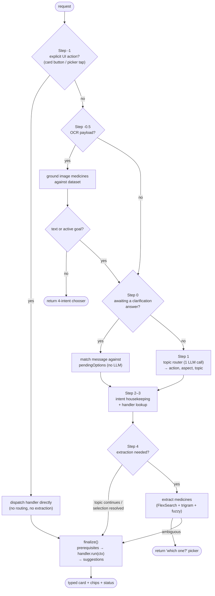
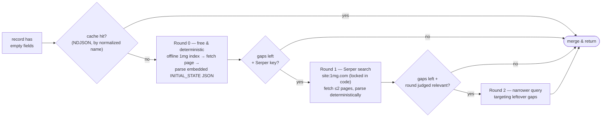

# The Chat Pipeline — one turn, under the microscope

Every chat interaction — typed message, tapped suggestion chip, card button, OCR result, clarification answer — arrives at a single endpoint, `POST /api/intent/classify`, and flows through one orchestrator: [`server/controllers/intent.controller.js`](../server/controllers/intent.controller.js) (`handleClassify`). This document walks through that turn in execution order, then zooms into the four subsystems that do the heavy lifting.

For the system-level picture (data layer, safety engine, LLM strategy, API surface) see **[ARCHITECTURE.md](../ARCHITECTURE.md)**.

**Contents**

1. [Turn lifecycle](#1-turn-lifecycle)
2. [Topic detection — the router](#2-topic-detection--the-router)
3. [Medicine detection — how names are found in free text](#3-medicine-detection--how-names-are-found-in-free-text)
4. [When web search fires — lazy enrichment](#4-when-web-search-fires--lazy-enrichment)
5. [Session & context — how "it" resolves](#5-session--context--how-it-resolves)

---

## 1. Turn lifecycle

The request body is `{ sessionId, message, history, action?, ocr?, safetyContext? }`. The controller is organized as numbered steps (the comments in the source use the same numbers):



- **Step -1 — explicit UI actions** bypass all intelligence. A tap on a card's *Explain* button (`card_explain`), a comparison pick (`compare_pick`), or the image-intent chooser (`intent_pick`) carries the medicine id and intent directly — deterministic, zero LLM calls before the handler runs.
- **Step -0.5 — OCR ingestion**: structured medicines from the vision model are grounded against the dataset ([§3](#3-medicine-detection--how-names-are-found-in-free-text)). No accompanying text → the 4-intent chooser; ambiguous grounding → a disambiguation picker; `documentType: "unrelated"` → a polite miss.
- **Step 0 — clarification lock**: if the previous turn asked a question (session `stage` is one of the `awaiting_*` states), the current message is first matched against the options that were offered — a pincode regex, a numbered pick, a medicine name — *before* any router runs. This is what keeps "the second one" working.
- **Step 1 — resolve intent**: the topic router ([§2](#2-topic-detection--the-router)) runs for fresh messages and for follow-ups on a completed conversation. Chip taps (`bubble` actions) carry their intent and skip it.
- **Step 2–3**: if the intent changed, prerequisites are reset (the medicines *pool* survives; per-intent state like pincode doesn't). The handler comes from a simple registry keyed by intent: `explain_medicine`, `find_alternatives`, `compare_medicines`, `schedule_medicine`, `check_availability`, `greetings`, `unrelated` ([server/handlers/](../server/handlers)).
- **Step 4 — extraction** ([§3](#3-medicine-detection--how-names-are-found-in-free-text)) runs only when needed — it's skipped for elliptical follow-ups (`topicContinues`), resolved clarifications, and chip taps.
- **`finalize()`** checks the handler's prerequisites (enough medicines? pincode present? compare needs two?), runs it with a context of `{ medicines, focusedMedicine, pincode, subField, openQuestion, safetyContext, … }`, updates the session, and generates suggestion chips.

Every exit path returns the same envelope: `{ intent, reply, status, …typed payload, suggestions }` — the typed payload (`cardData`, `comparisonData`, `alternativesData`, `scheduleFormData`, `medicineOptions`, …) tells the app which card component to render.

---

## 2. Topic detection — the router

One LLM call per turn ([`topicRouter.service.js`](../server/services/topicRouter.service.js), Groq `gpt-oss-20b`, JSON mode) answers three questions at once: *what does the user want* (action), *about which facet* (aspect), and *is this still the same medicine* (topic).

**Vocabularies** (whitelist-validated — anything off-list is treated as a routing failure):

| | Values |
|---|---|
| `action` | `overview, aspect, open_question, compare, alternatives, schedule, availability, chitchat, off_topic` |
| `aspect` | `price, side_effects, composition, uses, manufacturer, pack_size, dosage, interactions, safety` |
| `topic` | `continue, switch, new, none` |

Actions map onto the seven handlers via a fixed table (`ACTION_TO_INTENT`): `overview`/`aspect`/`open_question` all become `explain_medicine` (with different rendering — full card vs. one-line answer vs. grounded prose), the rest map 1:1.

Three design choices make this robust:

- **State beats history.** The prompt gets a compact state block — *current topic medicine, other medicines discussed, last thing shown* — plus only the last 6 turns of history. The state block is the load-bearing context; history is garnish.
- **A deterministic keyword guard backstops the LLM in both directions** (`applyAspectGuard`). If the message plainly contains one aspect keyword ("price?") but the LLM said `overview`, the guard downgrades it to the aspect — and if the LLM said `aspect` but returned an invalid one, the guard fills it from keywords or falls back to `open_question`. Cheap regexes correct the two most common LLM mistakes.
- **The fallback never dead-ends** (`fallbackRoute`). On any LLM failure or off-whitelist output: with an active topic, route to a keyword-guessed aspect or a grounded open question; without one, chitchat. The user never sees a routing error.

**The `topicContinues` rule** is the subtle one: when the router says `topic: continue` and the action is overview/aspect/open_question, **medicine extraction is skipped entirely** and the session's `focusedMedicine` is reused. This is why "and its side effects?" works — without the rule, the fuzzy matcher would happily find some medicine named like a filler word in that sentence.

*(A legacy two-call pipeline — separate intent classifier + drift checker in [`intent.service.js`](../server/services/intent.service.js) — still exists behind `USE_TOPIC_ROUTER=false`, kept for A/B fallback.)*

---

## 3. Medicine detection — how names are found in free text

The problem: spot "dolo 650", "shelcal", or a typo'd "augmentn" inside a casual sentence, against **254K product names**, without hallucinating matches in ordinary words. [`medicineExtraction.service.js`](../server/services/medicineExtraction.service.js) does this with classic IR techniques — no LLM in the hot path.

**Two indexes, built at boot:**

1. A **FlexSearch** document index over full names (forward tokenization) — fast, handles prefixes and exact-ish hits.
2. A **character-trigram index** over *base names* (form/dosage words stripped) — high-recall fallback that catches typos FlexSearch misses.

**Candidate generation:** the message is split into 1–4-word n-grams (letter/digit boundaries split too, so "dolo650" works). Obvious junk spans — bare stopwords, lone dosage tokens like `650mg`, bare form words like `tablet` — are skipped. FlexSearch runs first; only if it finds nothing does the trigram pass run.

**Scoring — `getSimilarity`:** every candidate is scored once against the cleaned query with weighted bidirectional token coverage:

- Token weights: **base word 1.0, dose 0.5, form 0.25** — "Dolo" matters, "650" helps, "tablet" barely counts.
- Per-token: exact match → 1; dose tokens compare *numeric value* (650 = 650mg); otherwise normalized Levenshtein with a **30% edit-distance tolerance** (so "augmentn" ≈ "augmentin").
- Final score = `precision × 0.7 + recall × 0.3` — precision (how much of the *query* the name explains) dominates, which is what stops long product names from matching short unrelated queries.

**The decision gate** (same thresholds everywhere):

| Condition | Outcome |
|---|---|
| top score ≥ **0.95** | auto-select (user typed the real name) |
| top ≥ **0.7** *and* lead over runner-up ≥ **0.12** | auto-select (clear winner) |
| multiple close candidates | return a "which one did you mean?" picker (top 5) |
| exactly one so-so candidate | one cheap LLM confirm ("did they mean this?") |
| nothing above the 0.5 relevance floor | fall through to ingredient-substring search |

**Compare gets extra machinery** (`resolveComparePair`): the query is segmented into up to two non-overlapping best-scoring spans ("dolo 650 vs calpol" → two mentions), each scored independently — and then a **smart-tier LLM** (`gpt-oss-120b`) validates the mentions, because fuzzy matching alone will cheerfully turn "**lets** compare" into the real medicine *Lets 2.5mg Tablet*. This validation call is one of only two places the expensive model is used.

The same `getSimilarity` scorer is reused everywhere a name must be trusted: OCR grounding, the offline 1mg index match, and post-fetch page verification — one fuzzy-matching definition of truth across the codebase.

---

## 4. When web search fires — lazy enrichment

~97% of dataset rows are missing description/side-effects/salt. Whenever a handler assembles a record with empty fields, [`lazyEnrichment.service.js`](../server/services/lazyEnrichment.service.js) tries to fill them — cheapest source first, and **only the missing fields** (existing CSV data is never overwritten):



- **Round 0 costs nothing external**: the ~374K-entry offline 1mg index resolves name → URL locally; the page's embedded `window.__INITIAL_STATE__` JSON is parsed with a brace-matching extractor — structured fields, not scraped HTML text.
- **Precision guards** keep wrong-page data out: the index match must score ≥ **0.85**; after fetching, the page's canonical name is re-verified against the query at ≥ **0.80** (same `getSimilarity` scorer); a tablet query rejects a syrup page outright (form-conflict check).
- **Rounds 1–2** exist only as a fallback and only if `SERPER_API_KEY` is set. An LLM builds the focused query, but the `site:1mg.com` lock is **enforced in code**, not trusted to the LLM. At most 2 pages are fetched per round; LLM snippet-echoing is a last resort for text fields only.
- **Safety fields are stricter**: `safety_advice` and `drug_interactions` come from deterministic page parsing **only** — never from search snippets, never via LLM — and are collected only when a health profile makes them relevant.
- **Caching**: positive results append to `data/lazyEnrichment.cache.ndjson` (public 1mg facts only — safe to persist); known-miss names are remembered in memory per run so Serper credits aren't re-spent on the same miss.

---

## 5. Session & context — how "it" resolves

Sessions live in an in-memory `Map` keyed by `sessionId`, evicted after **30 minutes idle** ([`session.service.js`](../server/services/session.service.js)) — nothing conversational is ever persisted. The shape:

```
{ activeIntent, stage, focusedMedicine, explainSubField, openQuestion,
  lastAction, lastAspect, lastAlternatives[], compareAnchor,
  prerequisites: { medicines[], pincode, … }, safetyContext }
```

- **`focusedMedicine`** is the pronoun resolver: the primary medicine of the last completed response. The topic router sees it in its state block; the `topicContinues` rule reuses it directly. Naming a different medicine simply re-focuses via extraction.
- **`stage`** is a small state machine: `completed` (default between exchanges) or one of the `awaiting_*` states — `awaiting_medicine`, `awaiting_compare_contender`, `awaiting_compare_medicine_2`, `awaiting_pincode`, `awaiting_intent`, … Each `awaiting_*` state stores `pendingOptions`, and the next message is matched against those *before* any routing (Step 0 above).
- **The medicines pool accumulates** — deduped by id, never replaced. Every medicine mentioned this session stays available, which is what makes "compare it with the first one" possible.

**Where the suggestion chips come from** — three sources, merged in order:

1. **Handler extras** — deterministic, prepended: e.g. after a one-line aspect answer, explain adds a *View full details* chip that triggers the full card via `card_explain`.
2. **LLM-generated follow-ups** ([suggestions.service.js](../server/services/suggestions.service.js), fast tier, 1–4 chips) — context-aware, and skipped where redundant: after *find alternatives*, the cards already carry Explain/Compare buttons, so only a schedule chip is offered without spending an LLM call.
3. **Deterministic choosers** — the disambiguation pickers, the compare dual-picker, and the post-scan 4-intent chooser are constructed directly by the controller, never by an LLM.

Each chip carries its own `{ label, text, action | intent }`, so tapping one re-enters the pipeline at Step -1 or Step 1 with zero ambiguity — a chip tap never needs routing or extraction.
